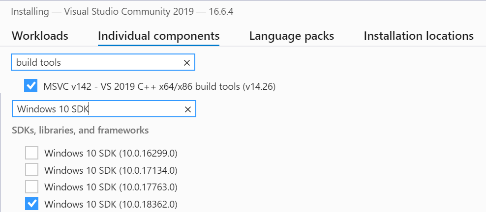

# Example Python package with a native C++ Parallel STL library maintained by CMake

This package deploys CMake and pybind11 to provide a thin Python API on top of a native (e.g. C/C++) code. The libraries are further bundled into a Python package using a provided CMake-aware `setup.py` config file. 

## Prerequisites

Windows: [Python](https://www.python.org/ftp/python/3.8.4/python-3.8.4-amd64.exe) [Git](https://github.com/git-for-windows/git/releases/download/v2.27.0.windows.1/Git-2.27.0-64-bit.exe) [CMake](https://github.com/Kitware/CMake/releases/download/v3.18.0/cmake-3.18.0-win64-x64.msi) [Ninja](https://github.com/rwols/CMakeBuilder/wiki/Ninja-for-Windows-Installation-Instructions) [Visual Studio Community Edition](https://visualstudio.microsoft.com/downloads/)

Visual Studio Installer configuration:



The following additional Python packages must be installed:

```
pip3 install wheel
```

## Building

Build and install the package using one of the three build options below.

## Building offline whl package

```
git clone --recurse-submodules https://github.com/apc-llc/arrsin.git
cd arrsin
python3 setup.py bdist_wheel -G Ninja
```

The resulting `.whl` package will be placed into the `dist/` folder, and could be installed with pip.

## Building online with pip

```
pip3 install git+https://github.com/apc-llc/arrsin.git --user
```

## Building for development

Prepare the virtual environment:

```
git clone --recurse-submodules https://github.com/apc-llc/arrsin.git
cd arrsin
python3 -m venv venv
source venv/bin/activate
```

Install the package with the editable state "-e" option:

```
pip3 install -e .
```

This will "alias" the current source folder to the installed package, effectively making the installed package editable directly.

## Testing

```
$ PYTHONPATH=$(pwd) python3
>>> import numpy as np
>>> x = np.random.uniform(-1, 1, size=(int(1e8),))
>>> import arrsin
>>> arrsin.arrsin_par(x)
```

